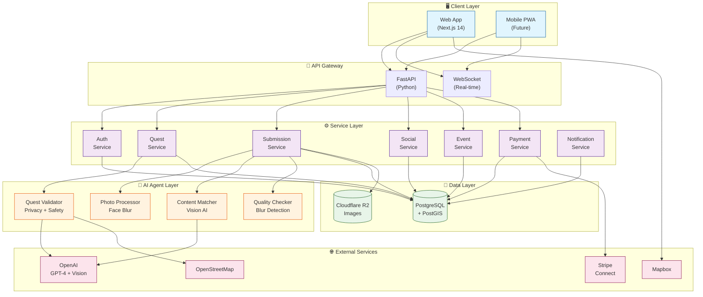
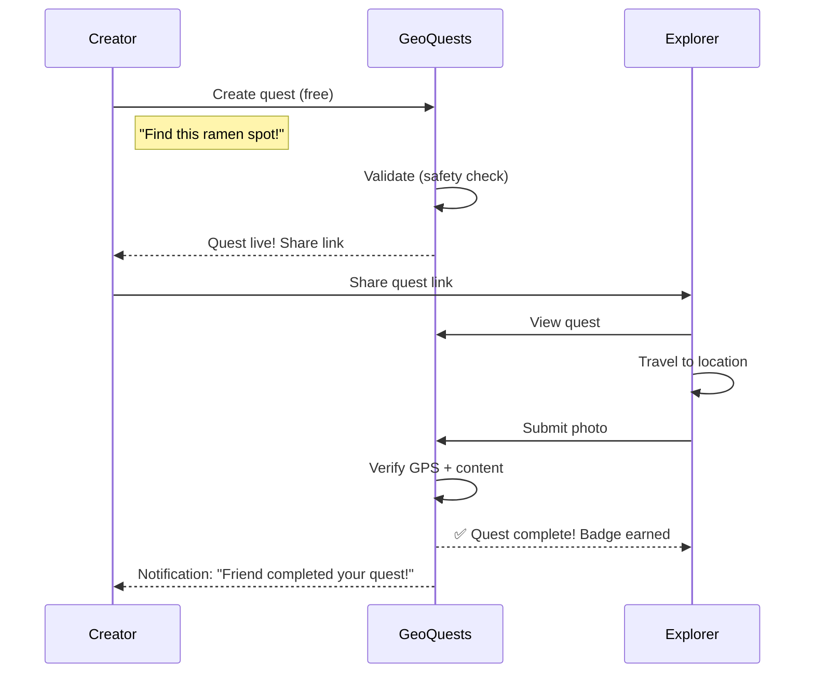
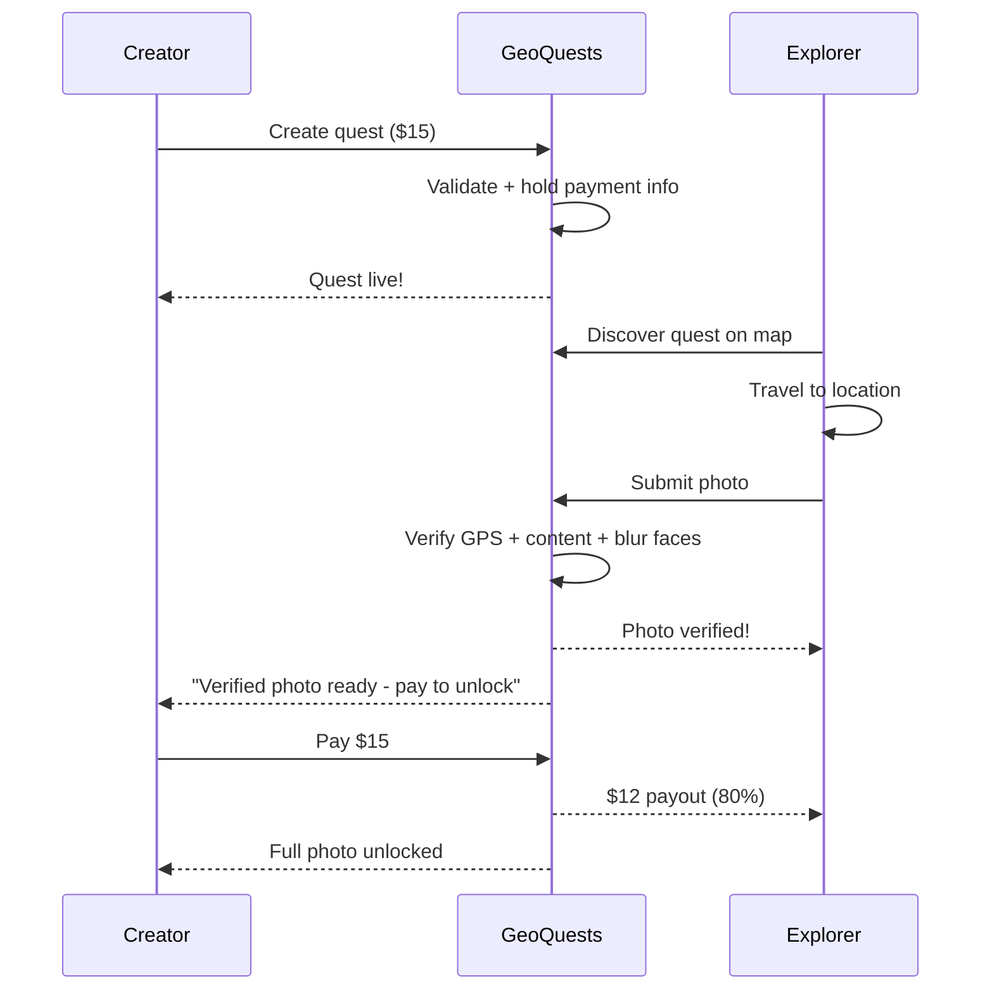
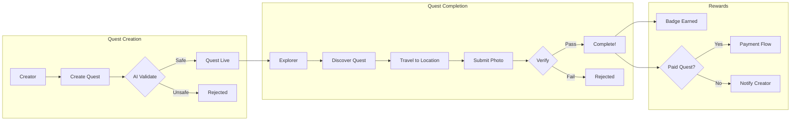
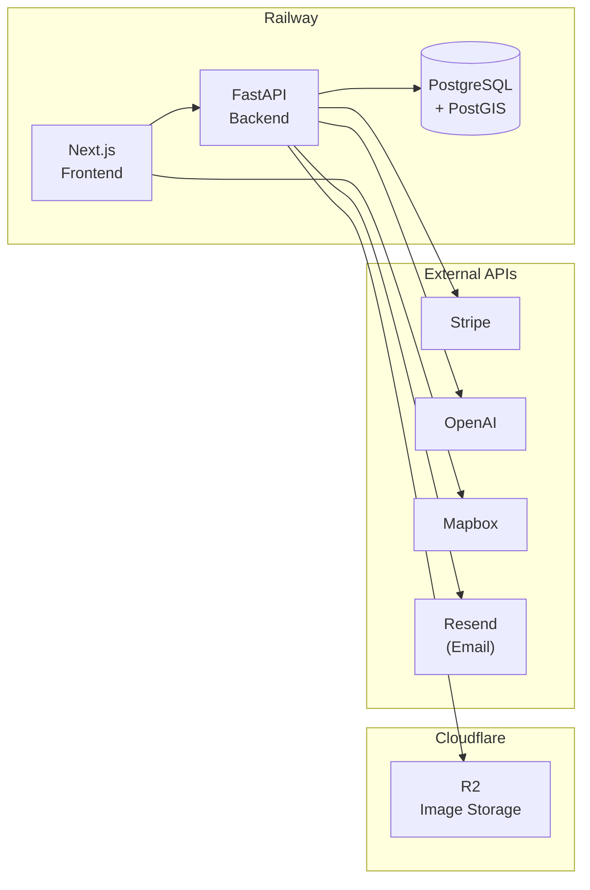

# High-Level Design (HLD)

## Product Overview

**GeoQuests** is a location-based platform where users create and complete photo quests at specific real-world locations.

### Value Proposition

| Emotional Value | Practical Value |
|-----------------|-----------------|
| Share meaningful places with friends | Check queue lengths before going |
| Discover hidden gems in your city | See real-time conditions (trails, beaches) |
| Challenge friends with scavenger hunts | Verify if places are open/available |
| Explore and earn badges | Crowd-sourced, verified information |
| *"Have fun, go outside"* | *"Get real answers, save time"* |

### Core User Journeys

1. **Explorer**: Open app → See map → Find quest → Travel → Take photo → Complete
2. **Creator**: Open app → Tap create → Set location → Describe quest → Share
3. **Practical User**: Need info → Create quest → Someone nearby completes it → Get verified photo

---

## System Architecture Overview



## Layer Descriptions

### 1. Client Layer
| Component | Technology | Purpose |
|-----------|------------|---------|
| Web App | Next.js 14 (App Router) | Main web interface with SSR |
| Mobile PWA | Progressive Web App | Future mobile-first experience |

**Key Features:**
- Mapbox GL JS for interactive quest map
- Browser MediaDevices API for GPS-locked camera
- Geolocation API for position verification
- Stripe Elements for payments
- Real-time updates via WebSocket

### 2. API Gateway
| Component | Purpose |
|-----------|---------|
| FastAPI | REST API endpoints, request validation, auth middleware |
| WebSocket | Real-time updates (quest completions, friend activity, notifications) |

**Endpoints Overview:**
```
/api/auth/*         → Authentication (signup, login, OAuth)
/api/quests/*       → Quest CRUD, nearby search, chains
/api/submissions/*  → Photo upload, verification status
/api/social/*       → Friends, activity feed, sharing
/api/events/*       → Challenges, competitions, badges
/api/payments/*     → Checkout creation, webhooks
/api/users/*        → Profile, stats, badges
```

### 3. Service Layer

| Service | Responsibilities |
|---------|-----------------|
| **Auth Service** | `fastapi-users` library with JWT tokens, Google OAuth, magic link (passwordless email) |
| **Quest Service** | Create/list/search quests, geospatial queries, quest chains |
| **Submission Service** | Image upload, verification orchestration |
| **Social Service** | Friends, follows, activity feed, sharing |
| **Event Service** | Challenges, competitions, badge assignment |
| **Payment Service** | Stripe Connect, paid quest payments, payouts |
| **Notification Service** | Email, push notifications, in-app alerts |

### 4. AI Agent Layer

This is the **trust layer** - what verifies real-world presence.

```
┌─────────────────────────────────────────────────────────────────┐
│                      AI AGENT PIPELINE                          │
├─────────────────────────────────────────────────────────────────┤
│                                                                 │
│  QUEST CREATION                         QUEST COMPLETION        │
│  ──────────────                         ────────────────        │
│                                                                 │
│  ┌─────────────────┐                    ┌─────────────────┐     │
│  │ Quest Validator │                    │ Photo Processor │     │
│  │                 │                    │                 │     │
│  │ • Is location   │                    │ • GPS within    │     │
│  │   public?       │                    │   radius?       │     │
│  │ • Privacy       │                    │ • Detect faces  │     │
│  │   check?        │                    │ • Auto-blur     │     │
│  │ • Content       │                    │ • Add watermark │     │
│  │   policy OK?    │                    │   (if paid)     │     │
│  └────────┬────────┘                    └────────┬────────┘     │
│           │                                      │              │
│           ▼                                      ▼              │
│  ┌─────────────────┐                    ┌─────────────────┐     │
│  │ OpenStreetMap   │                    │ Content Matcher │     │
│  │ Location Check  │                    │                 │     │
│  └─────────────────┘                    │ Vision AI:      │     │
│                                         │ "Does photo     │     │
│                                         │  match quest    │     │
│                                         │  description?"  │     │
│                                         └─────────────────┘     │
│                                                                 │
└─────────────────────────────────────────────────────────────────┘
```

| Agent | Input | Output | Technology |
|-------|-------|--------|------------|
| **Quest Validator** | Title, description, location | SAFE/UNSAFE verdict | GPT-4 + OSM |
| **Photo Processor** | Raw image bytes | Blurred faces, watermark | MediaPipe + OpenCV |
| **Content Matcher** | Image + description | Match score (0-100%) | GPT-4 Vision |
| **Quality Checker** | Image | Quality score, blur detection | OpenCV |

### 5. Data Layer

| Store | Purpose | Key Features |
|-------|---------|--------------|
| **PostgreSQL + PostGIS** | Primary database | Geospatial indexing, ACID compliance |
| **Cloudflare R2** | Image storage | S3-compatible, zero egress fees, global CDN |

**PostGIS Magic - Find Quests Near Me:**
```sql
SELECT *, ST_Distance(location, ST_MakePoint(lng, lat)::geography) as distance
FROM quests
WHERE ST_DWithin(location, ST_MakePoint(lng, lat)::geography, 10000)
  AND status = 'active'
ORDER BY distance;
```

### 6. External Services

| Service | Purpose | Integration |
|---------|---------|-------------|
| **Stripe Connect** | Paid quest payments | Platform takes 20%, explorer gets 80% |
| **Mapbox** | Map rendering | GL JS for web, custom quest markers |
| **OpenAI** | AI processing | GPT-4 for text, Vision for images |
| **OpenStreetMap** | Location data | Overpass API for place type lookup |

---

## Quest Types & Flows

### Social Quest (Free)



### Paid Quest



---

## Data Flow Summary



---

## Deployment Architecture



**MVP Stack:**
- **Frontend**: Railway (Next.js)
- **Backend**: Railway (FastAPI)
- **Database**: Railway PostgreSQL (managed, includes PostGIS)
- **Images**: Cloudflare R2 (zero egress fees)
- **Email**: Resend (magic link emails)

**Local Development:** Docker Compose for PostgreSQL + PostGIS

**Estimated Cost:** ~$10-15/month

---

## Key Differences: Social vs Paid Quests

| Aspect | Social Quest | Paid Quest |
|--------|--------------|------------|
| **Cost** | Free | Creator sets price |
| **Visibility** | Friends only or public | Public (marketplace) |
| **Verification** | GPS + basic content | GPS + Vision AI + face blur |
| **Reward** | Badge + XP | Money (80% to explorer) |
| **Photo Access** | Immediate | Pay-to-unlock |
| **Use Case** | Friends, memories, fun | Business, real estate, travel |
