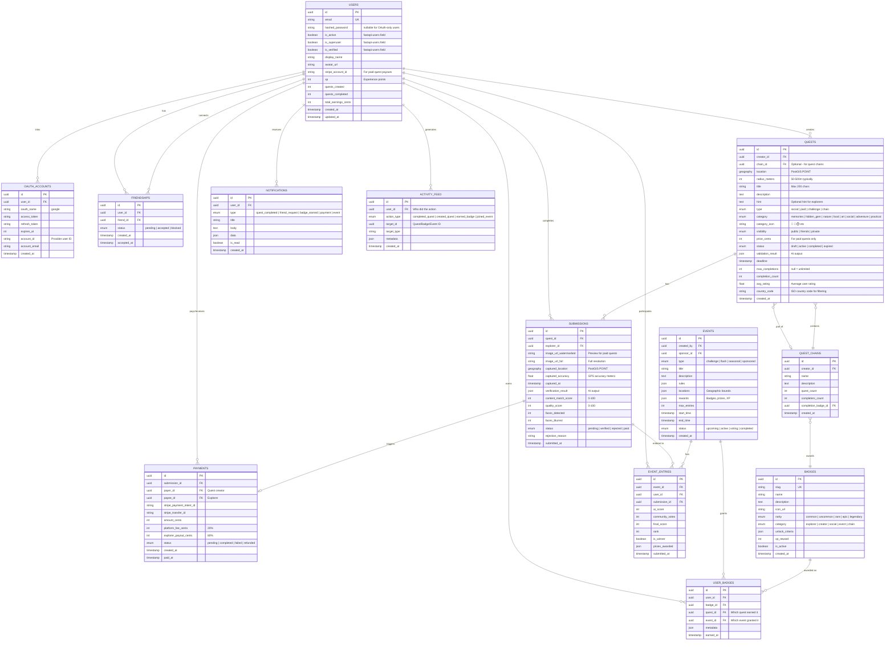

# Entity Relationship Diagram (ERD)

## Complete Database Schema



---

## Table Details

### USERS

Core user table - everyone can create quests and explore.

| Column | Type | Description |
|--------|------|-------------|
| `id` | UUID | Primary key |
| `email` | VARCHAR(255) | Unique, for auth |
| `username` | VARCHAR(50) | Unique handle (@username) |
| `stripe_account_id` | VARCHAR(255) | For receiving paid quest payouts |
| `xp` | INT | Experience points, starts at 0 |
| `level` | INT | Calculated: `floor(sqrt(xp / 100))` |
| `quests_created` | INT | Count of quests created |
| `quests_completed` | INT | Count of quests completed |

**Indexes:**
```sql
CREATE UNIQUE INDEX idx_users_email ON users(email);
CREATE UNIQUE INDEX idx_users_username ON users(username);
```

### FRIENDSHIPS

Social connections between users.

| Column | Type | Description |
|--------|------|-------------|
| `user_id` | UUID | The user who sent request |
| `friend_id` | UUID | The user who received |
| `status` | ENUM | pending, accepted, blocked |

**Indexes:**
```sql
CREATE UNIQUE INDEX idx_friendships_pair ON friendships(user_id, friend_id);
CREATE INDEX idx_friendships_user ON friendships(user_id, status);
```

### QUESTS

The core quest table with geospatial location.

| Column | Type | Description |
|--------|------|-------------|
| `location` | GEOGRAPHY(POINT, 4326) | Lat/lng as PostGIS geography |
| `radius_meters` | INT | How close explorer must be |
| `type` | ENUM | social, paid, challenge, chain |
| `visibility` | ENUM | public, friends, private |
| `price_cents` | INT | Only for paid quests |
| `hint` | TEXT | Optional clue for explorers |
| `chain_id` | UUID | Links to quest chain (optional) |

**Quest Types:**
```
social    → Free, for friends/community, badge reward
paid      → Money reward, watermarked preview until paid
challenge → Part of platform event/competition
chain     → One of many in a multi-location adventure
```

**Visibility:**
```
public  → Anyone can see and complete
friends → Only friends of creator can see
private → Shared via direct link only
```

**Categories (for UI icons):**
| Category | Icon | Examples |
|----------|------|----------|
| `memories` | 💝 | Where we first met, childhood playground |
| `hidden_gem` | ✨ | Secret coffee spot, local favorite |
| `nature` | 🌅 | Sunset view, hiking trail, hidden waterfall |
| `food` | 🍜 | Best ramen, food truck check |
| `art` | 🎨 | Street art, murals, landmarks |
| `social` | 🎉 | Birthday scavenger hunt, challenges |
| `adventure` | 🧗 | Climb to the top, end of trail |
| `practical` | 🛠️ | Queue length, parking, is it open? |

**Indexes:**
```sql
-- Spatial index for "quests near me"
CREATE INDEX idx_quests_location ON quests USING GIST(location);
CREATE INDEX idx_quests_status ON quests(status);
CREATE INDEX idx_quests_creator ON quests(creator_id);
CREATE INDEX idx_quests_type ON quests(type);
CREATE INDEX idx_quests_visibility ON quests(visibility);
CREATE INDEX idx_quests_category ON quests(category);
CREATE INDEX idx_quests_country ON quests(country_code);
CREATE INDEX idx_quests_rating ON quests(avg_rating DESC);
```

### QUEST_CHAINS

Multi-location adventures (e.g., "Tokyo Ramen Trail").

| Column | Type | Description |
|--------|------|-------------|
| `name` | VARCHAR | Chain name |
| `quest_count` | INT | Number of quests in chain |
| `completers_count` | INT | Users who completed all |
| `completion_badge_id` | UUID | Badge awarded on full completion |

### SUBMISSIONS

Quest completion records with verification data.

| Column | Type | Description |
|--------|------|-------------|
| `image_url_watermarked` | VARCHAR | Preview (paid quests) |
| `image_url_full` | VARCHAR | Full resolution |
| `captured_location` | GEOGRAPHY(POINT) | Where photo was taken |
| `verification_result` | JSONB | Full AI pipeline output |
| `content_match_score` | INT | 0-100 from Vision AI |
| `faces_blurred` | INT | Count of faces auto-blurred |

**Verification Result JSON:**
```json
{
  "gps_verified": true,
  "distance_meters": 23.4,
  "content_match": {
    "score": 87,
    "matches": true,
    "reason": "Photo shows the requested ramen dish"
  },
  "faces": {
    "detected": 2,
    "blurred": 2
  },
  "quality": {
    "score": 92,
    "blur_detected": false
  }
}
```

### BADGES

Achievement badges with unlock criteria.

| Column | Type | Description |
|--------|------|-------------|
| `slug` | VARCHAR | Unique identifier |
| `rarity` | ENUM | common → legendary |
| `category` | ENUM | explorer, creator, social, event, chain |
| `unlock_criteria` | JSONB | Auto-unlock conditions |

**Badge Categories:**
```
explorer → Completing quests (10 quests, 5 countries, etc.)
creator  → Creating quests (first quest, 100 completions, etc.)
social   → Friend activities (10 friends, shared quests)
event    → Challenge/competition wins
chain    → Completing quest chains
```

**Unlock Criteria Examples:**
```json
// Explorer badge - 10 quests completed
{
  "type": "quests_completed",
  "count": 10
}

// Creator badge - quest gets 50 completions
{
  "type": "quest_completions",
  "count": 50
}

// Chain completion badge
{
  "type": "chain_complete",
  "chain_id": "tokyo-ramen-trail"
}
```

### ACTIVITY_FEED

Stores activity for friend feeds.

| Column | Type | Description |
|--------|------|-------------|
| `user_id` | UUID | Who did the action |
| `action_type` | ENUM | completed_quest, created_quest, etc. |
| `target_id` | UUID | Quest/Badge/Event ID |
| `metadata` | JSONB | Extra display info |

---

## SQL Schema

```sql
-- Enable PostGIS
CREATE EXTENSION IF NOT EXISTS postgis;
CREATE EXTENSION IF NOT EXISTS "uuid-ossp";

-- ENUM types
CREATE TYPE quest_type AS ENUM ('social', 'paid', 'challenge', 'chain');
CREATE TYPE quest_visibility AS ENUM ('public', 'friends', 'private');
CREATE TYPE quest_status AS ENUM ('draft', 'active', 'completed', 'expired');
CREATE TYPE submission_status AS ENUM ('pending', 'verified', 'rejected', 'paid');
CREATE TYPE payment_status AS ENUM ('pending', 'completed', 'failed', 'refunded');
CREATE TYPE friendship_status AS ENUM ('pending', 'accepted', 'blocked');
CREATE TYPE badge_rarity AS ENUM ('common', 'uncommon', 'rare', 'epic', 'legendary');
CREATE TYPE badge_category AS ENUM ('explorer', 'creator', 'social', 'event', 'chain');

-- USERS table
CREATE TABLE users (
    id UUID PRIMARY KEY DEFAULT uuid_generate_v4(),
    email VARCHAR(255) UNIQUE NOT NULL,
    password_hash VARCHAR(255) NOT NULL,
    name VARCHAR(100),
    username VARCHAR(50) UNIQUE NOT NULL,
    avatar_url VARCHAR(500),
    stripe_account_id VARCHAR(255),
    xp INT DEFAULT 0,
    level INT GENERATED ALWAYS AS (floor(sqrt(xp / 100.0))::int) STORED,
    quests_created INT DEFAULT 0,
    quests_completed INT DEFAULT 0,
    total_earnings_cents INT DEFAULT 0,
    is_verified BOOLEAN DEFAULT false,
    created_at TIMESTAMPTZ DEFAULT NOW(),
    updated_at TIMESTAMPTZ DEFAULT NOW()
);

-- FRIENDSHIPS table
CREATE TABLE friendships (
    id UUID PRIMARY KEY DEFAULT uuid_generate_v4(),
    user_id UUID REFERENCES users(id) ON DELETE CASCADE,
    friend_id UUID REFERENCES users(id) ON DELETE CASCADE,
    status friendship_status DEFAULT 'pending',
    created_at TIMESTAMPTZ DEFAULT NOW(),
    accepted_at TIMESTAMPTZ,
    UNIQUE(user_id, friend_id)
);

CREATE INDEX idx_friendships_user ON friendships(user_id, status);

-- QUEST_CHAINS table
CREATE TABLE quest_chains (
    id UUID PRIMARY KEY DEFAULT uuid_generate_v4(),
    creator_id UUID REFERENCES users(id) ON DELETE CASCADE,
    name VARCHAR(200) NOT NULL,
    description TEXT,
    quest_count INT DEFAULT 0,
    completers_count INT DEFAULT 0,
    completion_badge_id UUID,  -- Added after badges table
    created_at TIMESTAMPTZ DEFAULT NOW()
);

-- QUESTS table
CREATE TABLE quests (
    id UUID PRIMARY KEY DEFAULT uuid_generate_v4(),
    creator_id UUID REFERENCES users(id) ON DELETE CASCADE,
    chain_id UUID REFERENCES quest_chains(id) ON DELETE SET NULL,
    location GEOGRAPHY(POINT, 4326) NOT NULL,
    radius_meters INT DEFAULT 50 CHECK (radius_meters BETWEEN 10 AND 1000),
    title VARCHAR(200) NOT NULL,
    description TEXT,
    hint TEXT,
    type quest_type DEFAULT 'social',
    visibility quest_visibility DEFAULT 'public',
    price_cents INT CHECK (price_cents IS NULL OR price_cents >= 100),
    status quest_status DEFAULT 'draft',
    validation_result JSONB,
    deadline TIMESTAMPTZ,
    max_completions INT,
    completion_count INT DEFAULT 0,
    created_at TIMESTAMPTZ DEFAULT NOW()
);

CREATE INDEX idx_quests_location ON quests USING GIST(location);
CREATE INDEX idx_quests_status ON quests(status);
CREATE INDEX idx_quests_creator ON quests(creator_id);
CREATE INDEX idx_quests_type ON quests(type);
CREATE INDEX idx_quests_chain ON quests(chain_id);

-- SUBMISSIONS table
CREATE TABLE submissions (
    id UUID PRIMARY KEY DEFAULT uuid_generate_v4(),
    quest_id UUID REFERENCES quests(id) ON DELETE CASCADE,
    explorer_id UUID REFERENCES users(id) ON DELETE CASCADE,
    image_url_watermarked VARCHAR(500),
    image_url_full VARCHAR(500) NOT NULL,
    captured_location GEOGRAPHY(POINT, 4326) NOT NULL,
    captured_accuracy FLOAT,
    captured_at TIMESTAMPTZ NOT NULL,
    verification_result JSONB,
    content_match_score INT CHECK (content_match_score BETWEEN 0 AND 100),
    quality_score INT CHECK (quality_score BETWEEN 0 AND 100),
    faces_detected INT DEFAULT 0,
    faces_blurred INT DEFAULT 0,
    status submission_status DEFAULT 'pending',
    rejection_reason TEXT,
    submitted_at TIMESTAMPTZ DEFAULT NOW(),
    UNIQUE(quest_id, explorer_id)  -- One completion per user per quest
);

CREATE INDEX idx_submissions_quest ON submissions(quest_id);
CREATE INDEX idx_submissions_explorer ON submissions(explorer_id);

-- PAYMENTS table
CREATE TABLE payments (
    id UUID PRIMARY KEY DEFAULT uuid_generate_v4(),
    submission_id UUID REFERENCES submissions(id) ON DELETE SET NULL,
    payer_id UUID REFERENCES users(id),
    payee_id UUID REFERENCES users(id),
    stripe_payment_intent_id VARCHAR(255) UNIQUE,
    stripe_transfer_id VARCHAR(255),
    amount_cents INT NOT NULL,
    platform_fee_cents INT NOT NULL,
    explorer_payout_cents INT NOT NULL,
    status payment_status DEFAULT 'pending',
    created_at TIMESTAMPTZ DEFAULT NOW(),
    paid_at TIMESTAMPTZ
);

-- BADGES table
CREATE TABLE badges (
    id UUID PRIMARY KEY DEFAULT uuid_generate_v4(),
    slug VARCHAR(100) UNIQUE NOT NULL,
    name VARCHAR(100) NOT NULL,
    description TEXT,
    icon_url VARCHAR(500),
    rarity badge_rarity DEFAULT 'common',
    category badge_category NOT NULL,
    unlock_criteria JSONB,
    xp_reward INT DEFAULT 0,
    is_active BOOLEAN DEFAULT true,
    created_at TIMESTAMPTZ DEFAULT NOW()
);

-- Add foreign key to quest_chains after badges exists
ALTER TABLE quest_chains 
ADD CONSTRAINT fk_chain_badge 
FOREIGN KEY (completion_badge_id) REFERENCES badges(id);

-- USER_BADGES table
CREATE TABLE user_badges (
    id UUID PRIMARY KEY DEFAULT uuid_generate_v4(),
    user_id UUID REFERENCES users(id) ON DELETE CASCADE,
    badge_id UUID REFERENCES badges(id) ON DELETE CASCADE,
    quest_id UUID REFERENCES quests(id),
    event_id UUID,  -- Added later
    metadata JSONB,
    earned_at TIMESTAMPTZ DEFAULT NOW(),
    UNIQUE(user_id, badge_id)
);

CREATE INDEX idx_user_badges_user ON user_badges(user_id);

-- EVENTS table
CREATE TABLE events (
    id UUID PRIMARY KEY DEFAULT uuid_generate_v4(),
    created_by UUID REFERENCES users(id),
    sponsor_id UUID REFERENCES users(id),
    type VARCHAR(50) NOT NULL,
    title VARCHAR(200) NOT NULL,
    description TEXT,
    rules JSONB,
    locations JSONB,
    rewards JSONB,
    max_entries INT DEFAULT 1,
    start_time TIMESTAMPTZ NOT NULL,
    end_time TIMESTAMPTZ NOT NULL,
    status VARCHAR(50) DEFAULT 'upcoming',
    created_at TIMESTAMPTZ DEFAULT NOW()
);

-- EVENT_ENTRIES table
CREATE TABLE event_entries (
    id UUID PRIMARY KEY DEFAULT uuid_generate_v4(),
    event_id UUID REFERENCES events(id) ON DELETE CASCADE,
    user_id UUID REFERENCES users(id) ON DELETE CASCADE,
    submission_id UUID REFERENCES submissions(id),
    ai_score INT,
    community_votes INT DEFAULT 0,
    final_score INT,
    rank INT,
    is_winner BOOLEAN DEFAULT false,
    prizes_awarded JSONB,
    submitted_at TIMESTAMPTZ DEFAULT NOW(),
    UNIQUE(event_id, user_id, submission_id)
);

-- NOTIFICATIONS table
CREATE TABLE notifications (
    id UUID PRIMARY KEY DEFAULT uuid_generate_v4(),
    user_id UUID REFERENCES users(id) ON DELETE CASCADE,
    type VARCHAR(50) NOT NULL,
    title VARCHAR(200) NOT NULL,
    body TEXT,
    data JSONB,
    is_read BOOLEAN DEFAULT false,
    created_at TIMESTAMPTZ DEFAULT NOW()
);

CREATE INDEX idx_notifications_user ON notifications(user_id, is_read);

-- ACTIVITY_FEED table
CREATE TABLE activity_feed (
    id UUID PRIMARY KEY DEFAULT uuid_generate_v4(),
    user_id UUID REFERENCES users(id) ON DELETE CASCADE,
    action_type VARCHAR(50) NOT NULL,
    target_id UUID,
    target_type VARCHAR(50),
    metadata JSONB,
    created_at TIMESTAMPTZ DEFAULT NOW()
);

CREATE INDEX idx_activity_user ON activity_feed(user_id);
CREATE INDEX idx_activity_time ON activity_feed(created_at DESC);
```

---

## Useful Queries

### Find Quests Near Me (Public + Friends)
```sql
WITH my_friends AS (
    SELECT friend_id FROM friendships 
    WHERE user_id = $user_id AND status = 'accepted'
    UNION
    SELECT user_id FROM friendships 
    WHERE friend_id = $user_id AND status = 'accepted'
)
SELECT 
    q.*,
    u.name as creator_name,
    u.avatar_url as creator_avatar,
    ST_Distance(q.location, ST_SetSRID(ST_MakePoint($lng, $lat), 4326)::geography) as distance_meters
FROM quests q
JOIN users u ON q.creator_id = u.id
WHERE q.status = 'active'
  AND (q.deadline IS NULL OR q.deadline > NOW())
  AND ST_DWithin(q.location, ST_SetSRID(ST_MakePoint($lng, $lat), 4326)::geography, $radius)
  AND (
      q.visibility = 'public'
      OR (q.visibility = 'friends' AND q.creator_id IN (SELECT * FROM my_friends))
  )
ORDER BY distance_meters
LIMIT 50;
```

### Get Friend Activity Feed
```sql
WITH my_friends AS (
    SELECT friend_id AS id FROM friendships 
    WHERE user_id = $user_id AND status = 'accepted'
    UNION
    SELECT user_id AS id FROM friendships 
    WHERE friend_id = $user_id AND status = 'accepted'
)
SELECT 
    af.*,
    u.name,
    u.username,
    u.avatar_url
FROM activity_feed af
JOIN users u ON af.user_id = u.id
WHERE af.user_id IN (SELECT id FROM my_friends)
ORDER BY af.created_at DESC
LIMIT 20;
```

### Quest Chain Progress
```sql
SELECT 
    qc.*,
    COUNT(q.id) as total_quests,
    COUNT(s.id) as completed_quests,
    ROUND(COUNT(s.id)::numeric / COUNT(q.id) * 100) as progress_percent
FROM quest_chains qc
JOIN quests q ON q.chain_id = qc.id
LEFT JOIN submissions s ON s.quest_id = q.id 
    AND s.explorer_id = $user_id 
    AND s.status = 'verified'
WHERE qc.id = $chain_id
GROUP BY qc.id;
```

### Leaderboard - Most Quests Completed This Month
```sql
SELECT
    u.id,
    u.name,
    u.username,
    u.avatar_url,
    u.level,
    COUNT(s.id) as completions_this_month
FROM users u
JOIN submissions s ON s.explorer_id = u.id
WHERE s.status IN ('verified', 'paid')
  AND s.submitted_at >= DATE_TRUNC('month', CURRENT_DATE)
GROUP BY u.id
ORDER BY completions_this_month DESC
LIMIT 10;
```
