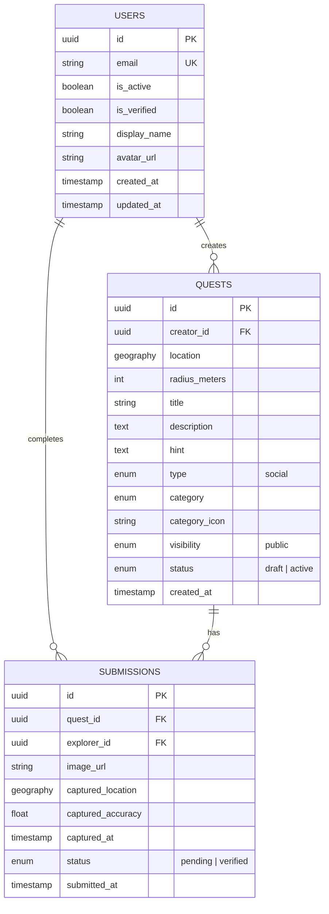

# ERD Evolution & Database Migration Guide

## Understanding Database Changes

### The Key Concept: **Database Migrations**

When you add features later, you don't "change the ERD" - you **migrate** the database using migration scripts. Think of it like version control for your database schema.

```
Initial Schema (MVP) → Migration 1 → Migration 2 → Current Schema
```

## How It Works

### Scenario: Adding Friends Feature Later

**Initial MVP Schema:**
```sql
-- Only USERS and QUESTS tables
CREATE TABLE users (...);
CREATE TABLE quests (...);
```

**Later, you want to add friends:**
```sql
-- Migration: 002_add_friendships.sql
CREATE TABLE friendships (
    id UUID PRIMARY KEY,
    user_id UUID REFERENCES users(id),
    friend_id UUID REFERENCES users(id),
    status VARCHAR(20) DEFAULT 'pending',
    created_at TIMESTAMPTZ DEFAULT NOW()
);
```

**Existing data?** ✅ **No problem!**
- Existing users remain unchanged
- New `friendships` table is empty initially
- Users can start adding friends immediately

## Types of Schema Changes

### 1. **Adding New Tables** (Safest)
```sql
-- Add a new table
CREATE TABLE badges (...);
```
✅ **Safe**: Doesn't affect existing data
✅ **Existing users**: Unaffected, just new empty table

### 2. **Adding New Columns** (Usually Safe)
```sql
-- Add a column with default value
ALTER TABLE users ADD COLUMN xp INT DEFAULT 0;
```
✅ **Safe**: All existing users get `xp = 0`
✅ **Existing users**: Automatically get the new field

### 3. **Adding Optional Columns** (Nullable)
```sql
-- Add optional column
ALTER TABLE quests ADD COLUMN chain_id UUID REFERENCES quest_chains(id);
```
✅ **Safe**: NULL for existing quests (they're not in chains)
✅ **Existing quests**: Unaffected, new quests can use it

### 4. **Adding Required Columns** (Needs Default)
```sql
-- Add required column with default
ALTER TABLE quests ADD COLUMN category VARCHAR(50) DEFAULT 'social';
```
✅ **Safe**: All existing quests get default value
⚠️ **Note**: You might want to update existing rows manually

### 5. **Removing Columns** (Rare, Dangerous)
```sql
-- Remove column (usually you don't do this)
ALTER TABLE users DROP COLUMN old_field;
```
⚠️ **Dangerous**: Data loss! Usually you:
- Mark as deprecated first
- Stop using it in code
- Remove later when safe

## MVP Schema Simplification

### What to Start With

**Core Tables (MVP):**
1. ✅ `users` - Authentication & basic profile
2. ✅ `quests` - Quest creation
3. ✅ `submissions` - Quest completion

**Skip for Now:**
- ❌ `friendships` - Add later
- ❌ `payments` - Add later
- ❌ `badges` - Add later
- ❌ `events` - Add later
- ❌ `quest_chains` - Add later
- ❌ `notifications` - Add later
- ❌ `activity_feed` - Add later

### Simplified MVP ERD



## Migration Strategy

### Using Alembic (Python) or Similar

**Migration File Structure:**
```
backend/
├── alembic/
│   ├── versions/
│   │   ├── 001_initial_schema.py
│   │   ├── 002_add_friendships.py
│   │   ├── 003_add_payments.py
│   │   └── ...
│   └── env.py
```

**Example Migration:**
```python
# 002_add_friendships.py
def upgrade():
    op.create_table(
        'friendships',
        sa.Column('id', sa.UUID(), nullable=False),
        sa.Column('user_id', sa.UUID(), nullable=False),
        sa.Column('friend_id', sa.UUID(), nullable=False),
        sa.Column('status', sa.String(), default='pending'),
        sa.Column('created_at', sa.DateTime(), nullable=False),
        sa.ForeignKeyConstraint(['user_id'], ['users.id']),
        sa.ForeignKeyConstraint(['friend_id'], ['users.id']),
        sa.PrimaryKeyConstraint('id')
    )

def downgrade():
    op.drop_table('friendships')
```

## Handling Existing Data

### Scenario 1: Adding XP System

**Before:**
```sql
users: id, email, display_name
```

**After Migration:**
```sql
users: id, email, display_name, xp, level
```

**Migration:**
```sql
-- Add columns with defaults
ALTER TABLE users 
ADD COLUMN xp INT DEFAULT 0,
ADD COLUMN level INT DEFAULT 1;

-- Update existing users (optional - they already have defaults)
UPDATE users SET xp = 0, level = 1 WHERE xp IS NULL;
```

**Result:**
- ✅ All existing users have `xp = 0`, `level = 1`
- ✅ New users also get these defaults
- ✅ No data loss

### Scenario 2: Adding Paid Quests

**Before:**
```sql
quests: id, title, description, type
-- type is always 'social'
```

**After:**
```sql
quests: id, title, description, type, price_cents
-- type can be 'social' or 'paid'
```

**Migration:**
```sql
-- Add nullable price column
ALTER TABLE quests 
ADD COLUMN price_cents INT CHECK (price_cents IS NULL OR price_cents >= 100);

-- Existing quests: price_cents = NULL (they're all social)
-- New paid quests: price_cents = 500 (e.g., $5.00)
```

**Result:**
- ✅ Existing quests remain social (price_cents = NULL)
- ✅ New quests can be paid
- ✅ No breaking changes

### Scenario 3: Adding Friends Feature

**Before:**
```sql
-- No friendships table
```

**After:**
```sql
-- New friendships table
CREATE TABLE friendships (...);
```

**Migration:**
```sql
CREATE TABLE friendships (
    id UUID PRIMARY KEY,
    user_id UUID REFERENCES users(id),
    friend_id UUID REFERENCES users(id),
    status VARCHAR(20) DEFAULT 'pending',
    created_at TIMESTAMPTZ DEFAULT NOW()
);
```

**Result:**
- ✅ New empty table
- ✅ Existing users unaffected
- ✅ Users can start adding friends immediately

## Best Practices

### 1. **Always Use Migrations**
Never manually change the database. Always use migration scripts.

### 2. **Add Columns as Nullable First**
```sql
-- Good: Start nullable
ALTER TABLE users ADD COLUMN new_field VARCHAR(255);

-- Later: Make required if needed
ALTER TABLE users ALTER COLUMN new_field SET NOT NULL;
```

### 3. **Provide Defaults for Required Fields**
```sql
-- Good: Default value
ALTER TABLE quests ADD COLUMN category VARCHAR(50) DEFAULT 'social';

-- Bad: No default (breaks existing data)
ALTER TABLE quests ADD COLUMN category VARCHAR(50) NOT NULL; -- ❌
```

### 4. **Test Migrations on Copy of Production Data**
Always test migrations on a copy of real data before running on production.

### 5. **Version Your Schema**
Keep track of schema versions:
```sql
CREATE TABLE schema_migrations (
    version VARCHAR(50) PRIMARY KEY,
    applied_at TIMESTAMPTZ DEFAULT NOW()
);
```

## Common Patterns

### Pattern 1: Feature Flags in Database
```sql
-- Add feature flag column
ALTER TABLE users ADD COLUMN has_friends_feature BOOLEAN DEFAULT false;

-- Enable for new users
-- Keep existing users with false (they don't have friends yet)
```

### Pattern 2: Soft Deletes
```sql
-- Add deleted_at instead of deleting
ALTER TABLE quests ADD COLUMN deleted_at TIMESTAMPTZ;

-- Existing quests: deleted_at = NULL (not deleted)
-- Deleted quests: deleted_at = NOW()
```

### Pattern 3: JSONB for Flexible Data
```sql
-- Add JSONB column for future features
ALTER TABLE quests ADD COLUMN metadata JSONB DEFAULT '{}';

-- Can store any data without schema changes
-- Existing quests: metadata = {}
-- New quests: metadata = {"custom_field": "value"}
```

## Real-World Example: Adding Payments

### Step 1: Add Payment Columns to Existing Tables
```sql
-- Add to users
ALTER TABLE users ADD COLUMN stripe_account_id VARCHAR(255);

-- Add to quests
ALTER TABLE quests ADD COLUMN price_cents INT;
ALTER TABLE quests ADD COLUMN type VARCHAR(20) DEFAULT 'social';

-- Add to submissions
ALTER TABLE submissions ADD COLUMN image_url_watermarked VARCHAR(500);
```

### Step 2: Create Payments Table
```sql
CREATE TABLE payments (
    id UUID PRIMARY KEY,
    submission_id UUID REFERENCES submissions(id),
    payer_id UUID REFERENCES users(id),
    payee_id UUID REFERENCES users(id),
    amount_cents INT NOT NULL,
    status VARCHAR(20) DEFAULT 'pending',
    created_at TIMESTAMPTZ DEFAULT NOW()
);
```

### Step 3: Update Existing Data
```sql
-- All existing quests are social (no price)
UPDATE quests SET type = 'social' WHERE type IS NULL;

-- All existing submissions don't have watermarked version
-- (they're from social quests, so no watermark needed)
```

## Summary

✅ **You CAN change the ERD later** - it's called migrations
✅ **Existing data is safe** - migrations handle it
✅ **Start simple** - MVP with 3 tables
✅ **Add features incrementally** - one migration at a time
✅ **Use migration tools** - Alembic, Flyway, etc.

**Key Takeaway:** Your ERD is a living document. Start with MVP, add features as needed. Migrations ensure existing users/data are never broken.
