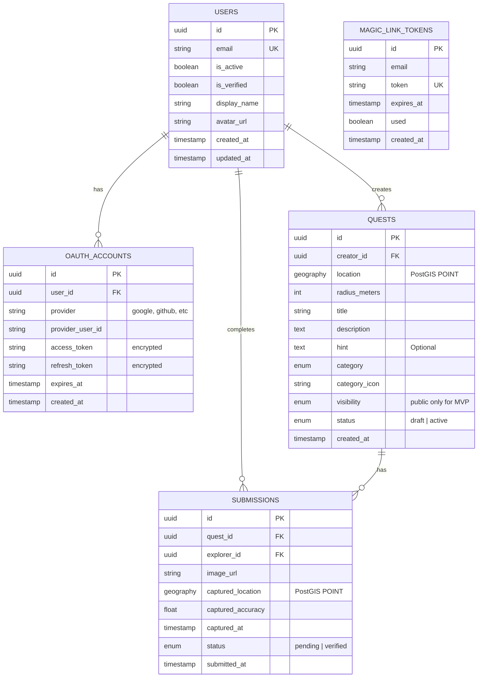

# ERD - MVP Version (Simplified)

## Overview

This is the **simplified MVP schema** for GeoQuests. Start with this, then add features incrementally using migrations.

## MVP Tables (5 Core Tables)

### 1. USERS
Basic authentication and profile.

### 2. OAUTH_ACCOUNTS
Linked OAuth provider accounts (Google, etc.).

### 3. MAGIC_LINK_TOKENS
One-time tokens for passwordless email login.

### 4. QUESTS
Quest creation (social quests only for MVP).

### 5. SUBMISSIONS
Quest completion with photo upload.

## MVP ERD Diagram



## SQL Schema (MVP)

```sql
-- Enable PostGIS for geospatial queries
CREATE EXTENSION IF NOT EXISTS postgis;
CREATE EXTENSION IF NOT EXISTS "uuid-ossp";

-- ENUM types (minimal for MVP)
CREATE TYPE quest_category AS ENUM (
    'memories', 'hidden_gem', 'nature', 'food', 
    'art', 'social', 'adventure', 'practical'
);
CREATE TYPE quest_status AS ENUM ('draft', 'active');
CREATE TYPE submission_status AS ENUM ('pending', 'verified');

-- USERS table (OAuth + Magic Link only, no passwords)
CREATE TABLE users (
    id UUID PRIMARY KEY DEFAULT uuid_generate_v4(),
    email VARCHAR(255) UNIQUE NOT NULL,
    is_active BOOLEAN DEFAULT true,
    is_verified BOOLEAN DEFAULT false,
    display_name VARCHAR(100),
    avatar_url VARCHAR(500),
    created_at TIMESTAMPTZ DEFAULT NOW(),
    updated_at TIMESTAMPTZ DEFAULT NOW()
);

CREATE INDEX idx_users_email ON users(email);

-- OAUTH_ACCOUNTS table (linked OAuth provider accounts)
CREATE TABLE oauth_accounts (
    id UUID PRIMARY KEY DEFAULT uuid_generate_v4(),
    user_id UUID REFERENCES users(id) ON DELETE CASCADE NOT NULL,
    provider VARCHAR(50) NOT NULL,  -- 'google', 'github', etc.
    provider_user_id VARCHAR(255) NOT NULL,
    access_token VARCHAR(500),  -- Encrypted in production
    refresh_token VARCHAR(500),  -- Encrypted in production
    expires_at TIMESTAMPTZ,
    created_at TIMESTAMPTZ DEFAULT NOW(),
    UNIQUE(provider, provider_user_id)
);

CREATE INDEX idx_oauth_user ON oauth_accounts(user_id);
CREATE INDEX idx_oauth_provider_user ON oauth_accounts(provider, provider_user_id);

-- MAGIC_LINK_TOKENS table (one-time tokens for passwordless login)
CREATE TABLE magic_link_tokens (
    id UUID PRIMARY KEY DEFAULT uuid_generate_v4(),
    email VARCHAR(255) NOT NULL,
    token VARCHAR(255) UNIQUE NOT NULL,
    expires_at TIMESTAMPTZ NOT NULL,
    used BOOLEAN DEFAULT false,
    created_at TIMESTAMPTZ DEFAULT NOW()
);

CREATE INDEX idx_magic_link_token ON magic_link_tokens(token);
CREATE INDEX idx_magic_link_email ON magic_link_tokens(email);

-- QUESTS table (simplified - social quests only)
CREATE TABLE quests (
    id UUID PRIMARY KEY DEFAULT uuid_generate_v4(),
    creator_id UUID REFERENCES users(id) ON DELETE CASCADE,
    location GEOGRAPHY(POINT, 4326) NOT NULL,
    radius_meters INT DEFAULT 50 CHECK (radius_meters BETWEEN 10 AND 1000),
    title VARCHAR(200) NOT NULL,
    description TEXT,
    hint TEXT,
    category quest_category DEFAULT 'social',
    category_icon VARCHAR(10) DEFAULT '🎯',
    visibility VARCHAR(20) DEFAULT 'public',  -- Only public for MVP
    status quest_status DEFAULT 'draft',
    created_at TIMESTAMPTZ DEFAULT NOW()
);

-- Spatial index for "quests near me" queries
CREATE INDEX idx_quests_location ON quests USING GIST(location);
CREATE INDEX idx_quests_status ON quests(status);
CREATE INDEX idx_quests_creator ON quests(creator_id);

-- SUBMISSIONS table (simplified)
CREATE TABLE submissions (
    id UUID PRIMARY KEY DEFAULT uuid_generate_v4(),
    quest_id UUID REFERENCES quests(id) ON DELETE CASCADE,
    explorer_id UUID REFERENCES users(id) ON DELETE CASCADE,
    image_url VARCHAR(500) NOT NULL,
    captured_location GEOGRAPHY(POINT, 4326) NOT NULL,
    captured_accuracy FLOAT,
    captured_at TIMESTAMPTZ NOT NULL,
    status submission_status DEFAULT 'pending',
    submitted_at TIMESTAMPTZ DEFAULT NOW(),
    UNIQUE(quest_id, explorer_id)  -- One completion per user per quest
);

CREATE INDEX idx_submissions_quest ON submissions(quest_id);
CREATE INDEX idx_submissions_explorer ON submissions(explorer_id);
CREATE INDEX idx_submissions_status ON submissions(status);
```

## What's Removed for MVP

### Removed Tables (Add Later)
- ❌ `friendships` - Add when implementing social features
- ❌ `payments` - Add when implementing paid quests
- ❌ `badges` - Add when implementing gamification
- ❌ `user_badges` - Add with badges
- ❌ `events` - Add when implementing challenges
- ❌ `event_entries` - Add with events
- ❌ `quest_chains` - Add when implementing multi-location quests
- ❌ `notifications` - Add when implementing notifications
- ❌ `activity_feed` - Add when implementing social feed

### Removed Columns (Add Later)
- ❌ `users.xp` - Add with gamification
- ❌ `users.quests_created` - Add when needed (can calculate from queries)
- ❌ `users.quests_completed` - Add when needed (can calculate from queries)
- ❌ `users.stripe_account_id` - Add with payments
- ❌ `quests.type` - Only 'social' for MVP (no enum needed)
- ❌ `quests.price_cents` - Add with paid quests
- ❌ `quests.chain_id` - Add with quest chains
- ❌ `quests.validation_result` - Add with AI validation
- ❌ `quests.deadline` - Add when needed
- ❌ `quests.completion_count` - Can calculate from submissions
- ❌ `quests.avg_rating` - Add with rating system
- ❌ `submissions.verification_result` - Add with AI verification
- ❌ `submissions.content_match_score` - Add with AI
- ❌ `submissions.quality_score` - Add with AI
- ❌ `submissions.faces_detected` - Add with face blur feature
- ❌ `submissions.image_url_watermarked` - Add with paid quests

## MVP Features Supported

✅ User authentication (Google OAuth + Magic Link)
✅ User registration & login (passwordless)
✅ Create social quests
✅ View quests on map
✅ Complete quests (photo upload)
✅ Basic quest listing

## Migration Path to Full Schema

**Note:** OAuth and Magic Link are included in MVP (initial schema), so no migration needed for basic auth.

### Phase 1: Add Additional OAuth Providers (Week 2-3)
```sql
-- Migration: 002_add_github_oauth.sql
-- No schema changes needed - oauth_accounts table already supports multiple providers
-- Just add GitHub OAuth configuration in code
```

### Phase 2: Add Friends (Week 4-5)
```sql
-- Migration: 003_add_friendships.sql
CREATE TABLE friendships (
    id UUID PRIMARY KEY,
    user_id UUID REFERENCES users(id),
    friend_id UUID REFERENCES users(id),
    status VARCHAR(20) DEFAULT 'pending',
    created_at TIMESTAMPTZ DEFAULT NOW()
);
```

### Phase 3: Add Payments (Week 6-7)
```sql
-- Migration: 004_add_payments.sql
-- Add columns to existing tables
ALTER TABLE users ADD COLUMN stripe_account_id VARCHAR(255);
ALTER TABLE quests ADD COLUMN type VARCHAR(20) DEFAULT 'social';
ALTER TABLE quests ADD COLUMN price_cents INT;

-- Create payments table
CREATE TABLE payments (...);
```

### Phase 4: Add Gamification (Week 8+)
```sql
-- Migration: 005_add_badges.sql
CREATE TABLE badges (...);
CREATE TABLE user_badges (...);
ALTER TABLE users ADD COLUMN xp INT DEFAULT 0;
```

## Example Queries (MVP)

### Find Quests Near Me
```sql
SELECT 
    q.*,
    u.display_name as creator_name,
    ST_Distance(
        q.location, 
        ST_SetSRID(ST_MakePoint($lng, $lat), 4326)::geography
    ) as distance_meters
FROM quests q
JOIN users u ON q.creator_id = u.id
WHERE q.status = 'active'
  AND ST_DWithin(
      q.location, 
      ST_SetSRID(ST_MakePoint($lng, $lat), 4326)::geography, 
      $radius_meters
  )
ORDER BY distance_meters
LIMIT 50;
```

### Get User's Created Quests
```sql
SELECT * FROM quests 
WHERE creator_id = $user_id 
ORDER BY created_at DESC;
```

### Get User's Completed Quests
```sql
SELECT 
    s.*,
    q.title,
    q.description
FROM submissions s
JOIN quests q ON s.quest_id = q.id
WHERE s.explorer_id = $user_id
  AND s.status = 'verified'
ORDER BY s.submitted_at DESC;
```

## Summary

**Start Simple:**
- 5 tables: `users`, `oauth_accounts`, `magic_link_tokens`, `quests`, `submissions`
- OAuth + Magic Link authentication (no passwords)
- Basic fields only
- Social quests only (no payments)
- No AI validation (manual approval for MVP)
- No gamification (add later)

**Add Features Later:**
- Use migrations (see `04-erd-evolution.md`)
- Existing data stays safe
- No breaking changes

## Authentication Flow

### OAuth Flow (Google)
1. User clicks "Sign in with Google"
2. Redirect to `/auth/google/authorize`
3. Google OAuth consent screen
4. Google redirects to `/auth/google/callback` with code
5. Exchange code for access token
6. Get user info from Google API
7. Create/update user and oauth_account record
8. Generate JWT tokens
9. Redirect to frontend with tokens

### Magic Link Flow
1. User enters email at `/auth/magic-link`
2. Generate secure token (itsdangerous)
3. Store token in `magic_link_tokens` table
4. Send email via Resend with magic link
5. User clicks link → `/auth/magic-link/verify?token=xxx`
6. Verify token (check expiration, not used)
7. Create/update user
8. Mark token as used
9. Generate JWT tokens
10. Return tokens to frontend
