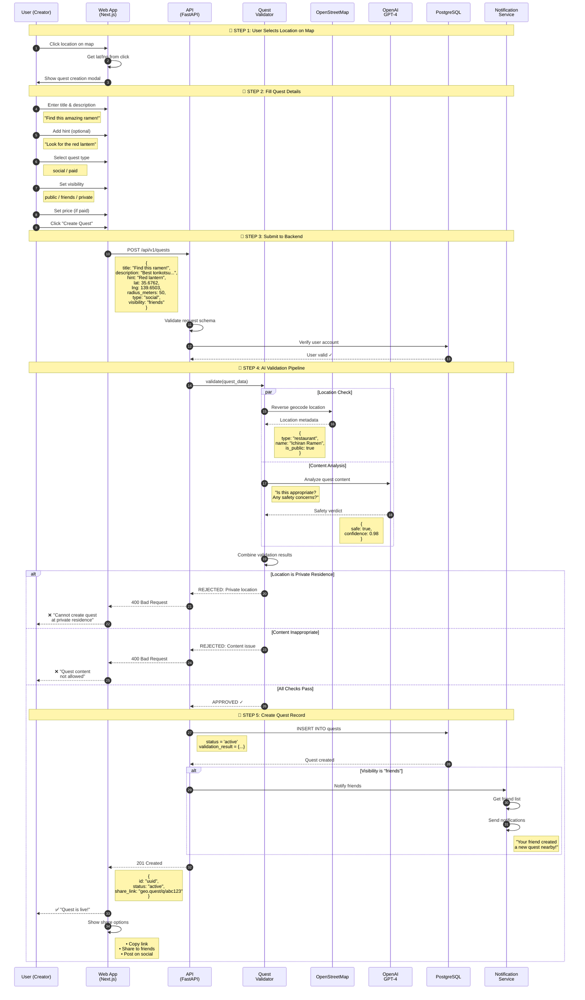
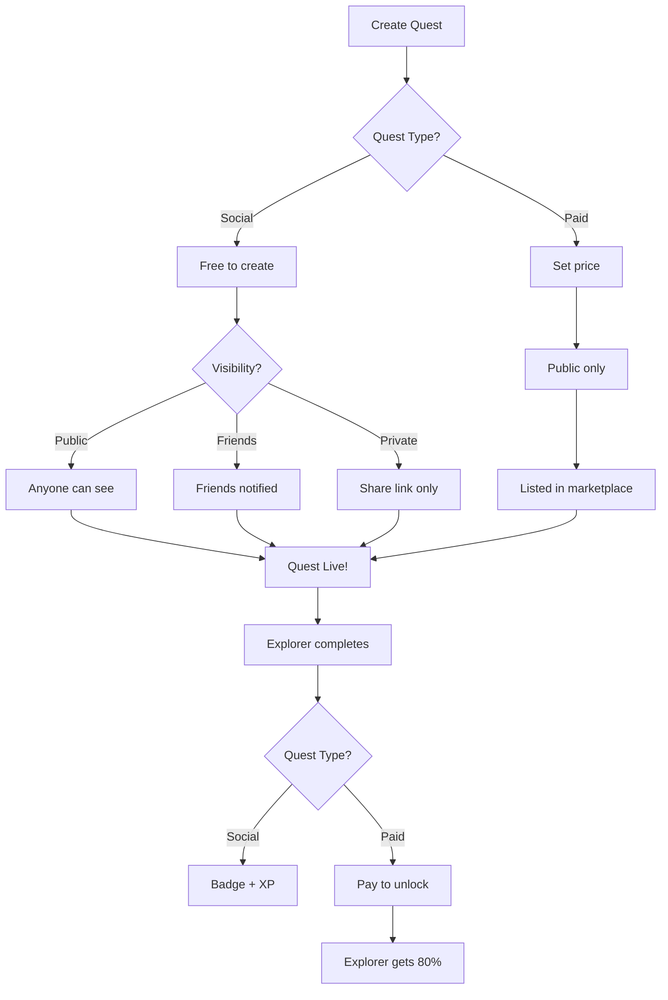

# Sequence Diagram: Quest Creation Flow

## Overview

This diagram shows the complete flow when a user creates a new **Quest** - whether it's a social quest for friends or a paid quest for the marketplace.

## Sequence Diagram



## Quest Types

### Social Quest (Default)
```
Purpose: Fun, memories, friend challenges
Cost: Free to create
Reward: Badge + XP for explorer
Visibility: Public, friends, or private
Example: "Find this dish I loved in Tokyo!"
```

### Paid Quest
```
Purpose: Need verified photos from specific location
Cost: Creator sets price ($1 minimum)
Reward: 80% to explorer, 20% platform fee
Visibility: Public (marketplace)
Example: "Current photo of this rental property"
```

## Validation Details

### Location Check (OpenStreetMap)

```
SAFE location types:
├── restaurant, cafe, bar
├── tourism (attractions, viewpoints)
├── commercial (shops)
├── park, beach, public spaces
└── transportation (stations)

UNSAFE location types:
├── residential (houses, apartments)
├── private property
├── school, kindergarten
├── military installations
└── healthcare facilities
```

### Content Analysis (LLM)

The AI checks for:
```
✓ ALLOWED:
├── "Find this amazing view"
├── "Best coffee shop ever"
├── "Complete this hiking trail"
└── "Photo at grandma's favorite spot"

✗ NOT ALLOWED:
├── Requests targeting specific people
├── Surveillance-style requests
├── Inappropriate or illegal content
└── Requests that could enable harassment
```

## Error Handling

| Error | Status | User Message |
|-------|--------|--------------|
| Invalid location | 400 | "Please select a valid location" |
| Private residence | 400 | "Cannot create quests at private residences" |
| Inappropriate content | 400 | "Quest content not allowed" |
| Price too low (paid) | 400 | "Minimum quest reward is $1.00" |
| User not authenticated | 401 | "Please log in to create a quest" |
| Rate limit exceeded | 429 | "Too many requests. Try again later" |

## API Request/Response

### Request
```http
POST /api/v1/quests
Authorization: Bearer <jwt_token>
Content-Type: application/json

{
  "title": "Find this amazing ramen!",
  "description": "The best tonkotsu ramen I've ever had. Creamy broth, perfect noodles.",
  "hint": "Look for the red lantern outside",
  "lat": 35.6762,
  "lng": 139.6503,
  "radius_meters": 50,
  "type": "social",
  "visibility": "friends",
  "deadline": null
}
```

### Success Response
```json
{
  "id": "550e8400-e29b-41d4-a716-446655440000",
  "title": "Find this amazing ramen!",
  "description": "The best tonkotsu ramen...",
  "location": { "lat": 35.6762, "lng": 139.6503 },
  "radius_meters": 50,
  "type": "social",
  "visibility": "friends",
  "status": "active",
  "share_link": "https://geo.quest/q/abc123",
  "created_at": "2026-01-20T10:30:00Z"
}
```

### Rejection Response
```json
{
  "error": "validation_failed",
  "code": "PRIVATE_LOCATION",
  "message": "Cannot create quest at private residence",
  "details": {
    "location_type": "residential",
    "suggestion": "Choose a public location like a restaurant, park, or landmark"
  }
}
```

## Social Quest vs Paid Quest Flow


