# Sequence Diagram: Quest Creation Flow

## Overview

This diagram shows the complete flow when a user creates a new **Quest** - whether it's a social quest for friends or a paid quest for the marketplace.

## Sequence Diagram

```mermaid
sequenceDiagram
    autonumber
    participant U as User (Creator)
    participant W as Web App<br/>(Next.js)
    participant A as API<br/>(FastAPI)
    participant V as Quest<br/>Validator
    participant OSM as OpenStreetMap
    participant LLM as OpenAI<br/>GPT-4
    participant DB as PostgreSQL
    participant N as Notification<br/>Service

    Note over U,N: 📍 STEP 1: User Selects Location on Map

    U->>W: Click location on map
    W->>W: Get lat/lng from click
    W->>U: Show quest creation modal

    Note over U,N: 📝 STEP 2: Fill Quest Details

    U->>W: Enter title & description
    Note right of U: "Find this amazing ramen!"
    U->>W: Add hint (optional)
    Note right of U: "Look for the red lantern"
    U->>W: Select quest type
    Note right of U: social / paid
    U->>W: Set visibility
    Note right of U: public / friends / private
    U->>W: Set price (if paid)
    U->>W: Click "Create Quest"

    Note over U,N: 🚀 STEP 3: Submit to Backend

    W->>A: POST /api/v1/quests
    Note right of W: {<br/>  title: "Find this ramen!",<br/>  description: "Best tonkotsu...",<br/>  hint: "Red lantern",<br/>  lat: 35.6762,<br/>  lng: 139.6503,<br/>  radius_meters: 50,<br/>  type: "social",<br/>  visibility: "friends"<br/>}

    A->>A: Validate request schema
    A->>DB: Verify user account
    DB-->>A: User valid ✓

    Note over U,N: 🤖 STEP 4: AI Validation Pipeline

    A->>V: validate(quest_data)

    par Location Check
        V->>OSM: Reverse geocode location
        OSM-->>V: Location metadata
        Note left of OSM: {<br/>  type: "restaurant",<br/>  name: "Ichiran Ramen",<br/>  is_public: true<br/>}
    and Content Analysis
        V->>LLM: Analyze quest content
        Note right of V: "Is this appropriate?<br/>Any safety concerns?"
        LLM-->>V: Safety verdict
        Note left of LLM: {<br/>  safe: true,<br/>  confidence: 0.98<br/>}
    end

    V->>V: Combine validation results

    alt Location is Private Residence
        V-->>A: REJECTED: Private location
        A-->>W: 400 Bad Request
        W-->>U: ❌ "Cannot create quest<br/>at private residence"
    else Content Inappropriate
        V-->>A: REJECTED: Content issue
        A-->>W: 400 Bad Request
        W-->>U: ❌ "Quest content<br/>not allowed"
    else All Checks Pass
        V-->>A: APPROVED ✓

        Note over U,N: 💾 STEP 5: Create Quest Record

        A->>DB: INSERT INTO quests
        Note right of A: status = 'active'<br/>validation_result = {...}
        DB-->>A: Quest created

        alt Visibility is "friends"
            A->>N: Notify friends
            N->>N: Get friend list
            N->>N: Send notifications
            Note right of N: "Your friend created<br/>a new quest nearby!"
        end

        A-->>W: 201 Created
        Note left of A: {<br/>  id: "uuid",<br/>  status: "active",<br/>  share_link: "geo.quest/q/abc123"<br/>}

        W-->>U: ✅ "Quest is live!"
        W->>W: Show share options
        Note right of W: • Copy link<br/>• Share to friends<br/>• Post on social
    end
```



## Quest Types

### Social Quest (Default)
```
Purpose: Fun, memories, friend challenges
Cost: Free to create
Reward: Badge + XP for explorer
Visibility: Public, friends, or private
Example: "Find this dish I loved in Tokyo!"
```

### Paid Quest
```
Purpose: Need verified photos from specific location
Cost: Creator sets price ($1 minimum)
Reward: 80% to explorer, 20% platform fee
Visibility: Public (marketplace)
Example: "Current photo of this rental property"
```

## Validation Details

### Location Check (OpenStreetMap)

```
SAFE location types:
├── restaurant, cafe, bar
├── tourism (attractions, viewpoints)
├── commercial (shops)
├── park, beach, public spaces
└── transportation (stations)

UNSAFE location types:
├── residential (houses, apartments)
├── private property
├── school, kindergarten
├── military installations
└── healthcare facilities
```

### Content Analysis (LLM)

The AI checks for:
```
✓ ALLOWED:
├── "Find this amazing view"
├── "Best coffee shop ever"
├── "Complete this hiking trail"
└── "Photo at grandma's favorite spot"

✗ NOT ALLOWED:
├── Requests targeting specific people
├── Surveillance-style requests
├── Inappropriate or illegal content
└── Requests that could enable harassment
```

## Error Handling

| Error | Status | User Message |
|-------|--------|--------------|
| Invalid location | 400 | "Please select a valid location" |
| Private residence | 400 | "Cannot create quests at private residences" |
| Inappropriate content | 400 | "Quest content not allowed" |
| Price too low (paid) | 400 | "Minimum quest reward is $1.00" |
| User not authenticated | 401 | "Please log in to create a quest" |
| Rate limit exceeded | 429 | "Too many requests. Try again later" |

## API Request/Response

### Request
```http
POST /api/v1/quests
Authorization: Bearer <jwt_token>
Content-Type: application/json

{
  "title": "Find this amazing ramen!",
  "description": "The best tonkotsu ramen I've ever had. Creamy broth, perfect noodles.",
  "hint": "Look for the red lantern outside",
  "lat": 35.6762,
  "lng": 139.6503,
  "radius_meters": 50,
  "type": "social",
  "visibility": "friends",
  "deadline": null
}
```

### Success Response
```json
{
  "id": "550e8400-e29b-41d4-a716-446655440000",
  "title": "Find this amazing ramen!",
  "description": "The best tonkotsu ramen...",
  "location": { "lat": 35.6762, "lng": 139.6503 },
  "radius_meters": 50,
  "type": "social",
  "visibility": "friends",
  "status": "active",
  "share_link": "https://geo.quest/q/abc123",
  "created_at": "2026-01-20T10:30:00Z"
}
```

### Rejection Response
```json
{
  "error": "validation_failed",
  "code": "PRIVATE_LOCATION",
  "message": "Cannot create quest at private residence",
  "details": {
    "location_type": "residential",
    "suggestion": "Choose a public location like a restaurant, park, or landmark"
  }
}
```

## Social Quest vs Paid Quest Flow


