# Sequence Diagram: Quest Completion Flow

## Overview

This diagram shows the complete flow when an **Explorer** discovers and completes a quest by visiting the location and submitting a verified photo.

## Sequence Diagram

```mermaid
sequenceDiagram
    autonumber
    participant E as Explorer
    participant W as Web App<br/>(Next.js)
    participant Geo as Geolocation<br/>API
    participant Cam as Camera<br/>API
    participant A as API<br/>(FastAPI)
    participant PP as Photo<br/>Processor
    participant CM as Content<br/>Matcher
    participant R2 as Cloudflare<br/>R2
    participant DB as PostgreSQL
    participant N as Notification<br/>Service
    participant C as Quest Creator

    Note over E,C: 🗺️ STEP 1: Discover Quest

    E->>W: Browse map / friend feed
    W->>A: GET /api/v1/quests/nearby
    A-->>W: List of quests
    E->>W: Tap quest marker
    W->>A: GET /api/v1/quests/{id}
    A-->>W: Quest details

    W->>W: Display quest card
    Note right of W: 🍜 "Find this ramen!"<br/>📍 23m away<br/>💡 "Red lantern"<br/>👤 Created by @foodie_friend

    E->>W: Click "Complete Quest"
    W->>W: Navigate to capture screen

    Note over E,C: 📡 STEP 2: Acquire GPS Lock

    W->>Geo: navigator.geolocation.watchPosition()
    Note right of Geo: High accuracy mode

    loop Until accuracy < 30m
        Geo-->>W: Position update
        W->>W: Display accuracy indicator
    end

    Geo-->>W: Final position
    Note left of Geo: {<br/>  lat: 35.6763,<br/>  lng: 139.6504,<br/>  accuracy: 12m<br/>}

    W->>W: Calculate distance to quest
    Note right of W: distance = 18m<br/>radius = 50m<br/>✓ Within range

    alt GPS Accuracy Too Low
        W-->>E: ⚠️ "GPS signal weak.<br/>Move to open area"
    else Too Far From Quest
        W-->>E: ❌ "You are 847m away.<br/>Get within 50m"
    else Within Range
        W-->>E: ✅ "You're here!<br/>Ready to capture"
    end

    Note over E,C: 📸 STEP 3: Capture Photo

    W->>Cam: navigator.mediaDevices.getUserMedia()
    Cam-->>W: Video stream
    W->>W: Display camera preview

    E->>W: Click shutter button
    W->>W: Capture frame to canvas
    W->>W: Convert to JPEG blob

    W->>W: Package submission
    Note right of W: {<br/>  image: Blob,<br/>  location: {...},<br/>  timestamp: now(),<br/>  quest_id: "..."<br/>}

    Note over E,C: 🚀 STEP 4: Upload & Verify

    W->>A: POST /api/v1/submissions
    Note right of W: multipart/form-data

    A->>DB: Verify quest is active
    DB-->>A: Quest valid ✓
    A->>DB: Check explorer hasn't completed
    DB-->>A: No duplicate ✓

    A->>A: Create submission (status: pending)
    A->>DB: INSERT submission
    DB-->>A: Submission ID

    Note over E,C: 🤖 STEP 5: AI Verification Pipeline

    par GPS Verification
        A->>A: Calculate distance
        Note right of A: Explorer: (35.6763, 139.6504)<br/>Quest: (35.6762, 139.6503)<br/>Distance: 18.2m ✓
    and Face Detection & Blur
        A->>PP: process(image_bytes)
        PP->>PP: Detect faces (MediaPipe)
        PP->>PP: Blur detected faces
        PP-->>A: Processed image
        Note left of PP: faces_blurred: 2
    and Content Matching
        A->>CM: match(image, quest)
        CM->>CM: GPT-4 Vision analysis
        Note right of CM: "Does this show<br/>the ramen dish?"
        CM-->>A: Match result
        Note left of CM: {<br/>  score: 91,<br/>  matches: true<br/>}
    end

    Note over E,C: 💾 STEP 6: Store & Complete

    alt Quest is PAID
        A->>PP: Add watermark
        PP-->>A: Watermarked version

        par Upload Watermarked
            A->>R2: PUT preview.jpg
            R2-->>A: URL
        and Upload Full
            A->>R2: PUT full.jpg
            R2-->>A: URL
        end
    else Quest is SOCIAL
        A->>R2: PUT photo.jpg
        R2-->>A: URL
    end

    alt Any Verification Failed
        A->>DB: UPDATE submission status = 'rejected'
        A-->>W: 400 Verification Failed
        W-->>E: ❌ "Quest not completed:<br/>[reason]"
    else All Checks Passed
        A->>DB: UPDATE submission status = 'verified'
        A->>DB: UPDATE quest completion_count++
        A->>DB: UPDATE explorer quests_completed++
        A->>DB: UPDATE explorer xp += 50

        A->>A: Check badge criteria
        Note right of A: First quest? → "First Steps" badge<br/>10 quests? → "Explorer" badge

        A->>N: Notify quest creator
        N->>C: 🔔 "Someone completed your quest!"

        A-->>W: 201 Quest Completed!
        Note left of A: {<br/>  status: "verified",<br/>  xp_earned: 50,<br/>  badges_earned: [...]<br/>}

        W-->>E: 🎉 "Quest Complete!"
        W->>W: Show celebration animation
        W->>W: Display earned badges
    end
```



## Verification Checks

### 1. GPS Verification

```
INPUT:
├── explorer_location: (35.6763, 139.6504)
├── explorer_accuracy: 12 meters
├── quest_location: (35.6762, 139.6503)
└── quest_radius: 50 meters

CALCULATION (Haversine):
├── distance: 18.2 meters
├── Is distance < radius? 18.2 < 50 ✓
└── Is accuracy acceptable? 12 < 100 ✓

RESULT: PASS ✓
```

### 2. Face Detection & Blur

```
PIPELINE:
1. Load image with OpenCV
2. Run MediaPipe FaceDetection
3. For each face detected:
   ├── Get bounding box
   ├── Add padding (20px)
   ├── Apply GaussianBlur(99, 99)
   └── Pixelate region
4. Return processed image

OUTPUT:
├── faces_detected: 2
├── faces_blurred: 2
└── processed_image: bytes
```

### 3. Content Matching (Vision AI)

```
GPT-4 Vision Prompt:
─────────────────────
A user is completing a quest. Does this photo match?

QUEST: Find this amazing ramen!
HINT: Look for the red lantern
DESCRIPTION: Best tonkotsu ramen with creamy broth

Score 0-100 how well the photo matches.

Response:
{
  "score": 91,
  "matches": true,
  "reason": "Photo shows a bowl of tonkotsu ramen
   with creamy white broth and noodles. Matches
   the quest description well."
}
─────────────────────
```

## Social Quest vs Paid Quest

### Social Quest Completion

```mermaid
sequenceDiagram
    participant E as Explorer
    participant A as API
    participant C as Creator

    E->>A: Submit photo
    A->>A: Verify (GPS + Content)
    A-->>E: ✅ Quest Complete!
    Note right of E: +50 XP<br/>+ Badge

    A->>C: Notification
    Note right of C: "Friend completed<br/>your quest!"

    C->>A: View completion
    Note right of C: See explorer's photo<br/>(full quality)
```


### Paid Quest Completion

```mermaid
sequenceDiagram
    participant E as Explorer
    participant A as API
    participant C as Creator

    E->>A: Submit photo
    A->>A: Verify + Add watermark
    A-->>E: ✅ Photo verified!

    A->>C: Notification
    Note right of C: "Verified photo ready!<br/>Pay to unlock."

    C->>A: View preview
    Note right of C: Watermarked preview only

    C->>A: Pay $15
    A-->>E: $12 payout (80%)
    A-->>C: Full photo unlocked

    Note over E,C: See payment-flow.md for details
```


## API Request/Response

### Request
```http
POST /api/v1/submissions
Authorization: Bearer <jwt_token>
Content-Type: multipart/form-data

------boundary
Content-Disposition: form-data; name="image"; filename="quest.jpg"
Content-Type: image/jpeg

[binary image data]
------boundary
Content-Disposition: form-data; name="metadata"
Content-Type: application/json

{
  "quest_id": "550e8400-e29b-41d4-a716-446655440000",
  "location": {
    "lat": 35.6763,
    "lng": 139.6504,
    "accuracy": 12
  },
  "captured_at": "2026-01-20T14:30:00Z"
}
------boundary--
```

### Success Response (Social Quest)
```json
{
  "id": "660e8400-e29b-41d4-a716-446655440001",
  "quest_id": "550e8400-e29b-41d4-a716-446655440000",
  "status": "verified",
  "image_url": "https://r2.example.com/photos/xyz.jpg",
  "verification_result": {
    "gps_verified": true,
    "distance_meters": 18.2,
    "content_match": { "score": 91, "matches": true },
    "faces_blurred": 2
  },
  "rewards": {
    "xp_earned": 50,
    "badges_earned": [
      { "slug": "first-quest", "name": "First Steps" }
    ]
  },
  "submitted_at": "2026-01-20T14:30:30Z"
}
```

### Success Response (Paid Quest)
```json
{
  "id": "660e8400-e29b-41d4-a716-446655440001",
  "quest_id": "550e8400-e29b-41d4-a716-446655440000",
  "status": "verified",
  "image_url_preview": "https://r2.example.com/preview/xyz.jpg",
  "verification_result": {
    "gps_verified": true,
    "content_match": { "score": 91, "matches": true },
    "faces_blurred": 2
  },
  "message": "Photo verified! Waiting for creator to pay.",
  "submitted_at": "2026-01-20T14:30:30Z"
}
```

### Rejection Response
```json
{
  "error": "verification_failed",
  "code": "CONTENT_MISMATCH",
  "message": "Photo doesn't match the quest",
  "details": {
    "content_match_score": 23,
    "reason": "Photo shows sushi, but quest asks for ramen",
    "suggestion": "Make sure to photograph the specific item in the quest"
  }
}
```

## Error Cases

| Error | Code | Message |
|-------|------|---------|
| Too far from location | `GPS_OUT_OF_RANGE` | "You're 847m away. Get within 50m" |
| GPS accuracy too low | `GPS_INACCURATE` | "GPS signal weak. Move to open area" |
| Content doesn't match | `CONTENT_MISMATCH` | "Photo doesn't match the quest" |
| Photo too blurry | `QUALITY_BLUR` | "Photo is too blurry" |
| Already completed | `ALREADY_COMPLETED` | "You've already completed this quest" |
| Quest expired | `QUEST_EXPIRED` | "This quest has expired" |
| Quest max completions | `QUEST_FULL` | "This quest has reached max completions" |

## Badge Triggers

Completing quests can trigger badge awards:

| Badge | Criteria |
|-------|----------|
| First Steps | Complete first quest |
| Explorer | Complete 10 quests |
| Globetrotter | Complete quests in 5 countries |
| Speed Runner | Complete within 5 min of viewing |
| Night Owl | Complete between 10PM-5AM |
| Chain Master | Complete a full quest chain |
