# Sequence Diagram: Payment & Photo Unlock Flow

## Overview

This diagram shows the payment flow for **Paid Quests** - when a quest creator pays to unlock the full-resolution photo after an explorer completes the quest.

> **Note:** This flow only applies to **paid quests**. Social quests are free and the creator sees the photo immediately.

## Sequence Diagram

```mermaid
sequenceDiagram
    autonumber
    participant C as Quest Creator
    participant W as Web App<br/>(Next.js)
    participant A as API<br/>(FastAPI)
    participant S as Stripe
    participant DB as PostgreSQL
    participant R2 as Cloudflare<br/>R2
    participant N as Notification<br/>Service
    participant E as Explorer

    Note over C,E: 📬 STEP 1: Creator Notified of Completion

    N->>C: 🔔 "Verified photo ready!"
    C->>W: Open notification
    W->>A: GET /api/v1/quests/{id}
    A-->>W: Quest with submission

    Note over C,E: 👀 STEP 2: View Verification & Preview

    W->>A: GET /api/v1/submissions/{id}/preview
    A->>R2: Get watermarked image URL
    R2-->>A: Signed URL (1h expiry)
    A-->>W: Preview data

    W->>W: Display submission card
    Note right of W: ┌────────────────────┐<br/>│ [Watermarked Photo]│<br/>│ 🔒 Pay to unlock   │<br/>├────────────────────┤<br/>│ ✅ GPS: 18m away   │<br/>│ ✅ Match: 91%      │<br/>│ ✅ 2 faces blurred │<br/>├────────────────────┤<br/>│ Explorer: @traveler│<br/>│ [Pay $15 to Unlock]│<br/>└────────────────────┘

    Note over C,E: 💳 STEP 3: Initiate Payment

    C->>W: Click "Pay $15 to Unlock"
    W->>A: POST /api/v1/payments/checkout
    Note right of W: { submission_id: "uuid" }

    A->>DB: Get submission + quest + explorer
    DB-->>A: Data with explorer stripe_account_id

    A->>A: Calculate fee split
    Note right of A: Total: $15.00<br/>Platform (20%): $3.00<br/>Explorer (80%): $12.00

    A->>S: Create PaymentIntent
    Note right of A: stripe.PaymentIntent.create(<br/>  amount=1500,<br/>  currency='usd',<br/>  application_fee_amount=300,<br/>  transfer_data={<br/>    destination: explorer_stripe_id<br/>  }<br/>)

    S-->>A: PaymentIntent
    Note left of S: {<br/>  id: "pi_xxx",<br/>  client_secret: "xxx"<br/>}

    A->>DB: INSERT payment (status: pending)
    A-->>W: { client_secret }

    Note over C,E: 💳 STEP 4: Complete Payment

    W->>W: Mount Stripe Elements
    W->>C: Display payment form

    C->>W: Enter card, click Pay
    W->>S: stripe.confirmPayment()

    S->>S: Process payment
    S->>S: Transfer to explorer
    S-->>W: Payment succeeded

    W-->>C: ✅ "Payment successful!"

    Note over C,E: 🪝 STEP 5: Webhook Processing

    S->>A: POST /payments/webhook
    Note right of S: payment_intent.succeeded

    A->>A: Verify webhook signature
    A->>DB: UPDATE payment status = 'completed'
    A->>DB: UPDATE submission status = 'paid'
    A->>DB: UPDATE explorer earnings + xp

    Note over C,E: 🔓 STEP 6: Unlock Full Photo

    A->>R2: Generate signed URL for full image
    R2-->>A: Signed URL (24h)

    A-->>W: Photo unlocked

    W->>A: GET /api/v1/submissions/{id}/full
    A-->>W: Full image URL
    W-->>C: 🖼️ Full photo displayed!
    W->>W: Show download button

    Note over C,E: 💸 STEP 7: Explorer Gets Paid

    A->>N: Notify explorer
    N->>E: 💰 "You earned $12.00!"

    E->>E: Check Stripe dashboard
    Note right of E: Balance: +$12.00
```



## Payment Split

```
┌─────────────────────────────────────────────────────────────────┐
│                        PAYMENT BREAKDOWN                         │
├─────────────────────────────────────────────────────────────────┤
│                                                                  │
│  Quest Creator pays:     $15.00                                  │
│                             │                                    │
│                             ▼                                    │
│                    ┌────────────────┐                            │
│                    │     STRIPE     │                            │
│                    │                │                            │
│                    │ PaymentIntent  │                            │
│                    │    $15.00      │                            │
│                    └───────┬────────┘                            │
│                            │                                     │
│              ┌─────────────┴─────────────┐                       │
│              │                           │                       │
│              ▼                           ▼                       │
│     ┌────────────────┐          ┌────────────────┐               │
│     │   GEOQUESTS    │          │   EXPLORER     │               │
│     │   (Platform)   │          │                │               │
│     │   $3.00 (20%)  │          │  $12.00 (80%)  │               │
│     │                │          │                │               │
│     │ application_   │          │ transfer_data. │               │
│     │ fee_amount     │          │ destination    │               │
│     └────────────────┘          └────────────────┘               │
│                                                                  │
│  Note: Stripe's processing fee (~2.9% + $0.30) comes from       │
│  the platform's 20% cut.                                         │
│                                                                  │
└─────────────────────────────────────────────────────────────────┘
```

## Explorer Stripe Connect Setup

Before explorers can receive payouts, they need to connect their Stripe account (one-time):

```mermaid
sequenceDiagram
    participant E as Explorer
    participant W as Web App
    participant A as API
    participant S as Stripe

    E->>W: Click "Set up payouts"
    W->>A: POST /api/v1/users/connect-stripe

    A->>S: stripe.accounts.create()
    Note right of A: type: 'express'

    S-->>A: Account created

    A->>S: stripe.accountLinks.create()
    S-->>A: Onboarding URL

    A-->>W: Redirect URL
    W->>E: Redirect to Stripe

    E->>S: Complete onboarding
    Note right of E: Bank details, verify identity

    S->>A: Webhook: account.updated
    A->>DB: Save stripe_account_id

    S-->>E: Redirect back
    E->>W: ✅ "Payouts enabled!"
```



## API Endpoints

### Create Checkout

```http
POST /api/v1/payments/checkout
Authorization: Bearer <jwt_token>
Content-Type: application/json

{
  "submission_id": "660e8400-e29b-41d4-a716-446655440001"
}
```

**Response:**
```json
{
  "client_secret": "pi_xxx_secret_xxx",
  "payment_id": "770e8400-e29b-41d4-a716-446655440002",
  "amount_cents": 1500,
  "currency": "usd"
}
```

### Get Full Photo (After Payment)

```http
GET /api/v1/submissions/{id}/full
Authorization: Bearer <jwt_token>
```

**Response:**
```json
{
  "image_url": "https://r2.example.com/full/xyz.jpg?sig=xxx&exp=xxx",
  "expires_at": "2026-01-21T14:30:00Z",
  "download_filename": "geoquests-ramen-tokyo.jpg"
}
```

## Webhook Events

| Event | Action |
|-------|--------|
| `payment_intent.succeeded` | Unlock photo, pay explorer, update stats |
| `payment_intent.payment_failed` | Notify creator of failure |
| `account.updated` | Update explorer's Stripe status |

## Edge Cases

### Explorer Not Connected to Stripe

```mermaid
sequenceDiagram
    participant C as Creator
    participant A as API
    participant E as Explorer

    C->>A: Try to pay
    A->>A: Check explorer.stripe_account_id
    Note right of A: Not connected!

    A->>A: Queue payment for later
    A-->>C: "Payment queued"

    A->>E: 🔔 "Connect Stripe to receive $12"

    E->>A: Completes Stripe setup

    A->>A: Process queued payment
    A-->>E: 💰 "$12 deposited!"
    A-->>C: 🔓 "Photo unlocked!"
```



### Creator Disputes Photo

```mermaid
sequenceDiagram
    participant C as Creator
    participant A as API
    participant Admin
    participant E as Explorer

    C->>A: "Photo doesn't match"
    A->>A: Create dispute

    Admin->>A: Review submission
    Admin->>A: Make decision

    alt Resolved for Creator
        A->>A: Process refund
        A-->>C: 💸 Refund issued
        A-->>E: ❌ Payout reversed
    else Resolved for Explorer
        A-->>C: Dispute rejected
        A-->>E: ✅ Payout confirmed
    end
```



## Why No Escrow?

Traditional escrow requires:
- Holding funds (money transmission licenses)
- Complex regulatory compliance
- Delayed payouts

**Our approach (Stripe Connect):**
- Payment processed at unlock time
- Instant split via `application_fee_amount`
- Explorer sees payout immediately
- No funds held by platform

This is simpler, faster, and legally cleaner for an MVP.
