# Sequence Diagram: Challenge & Event Entry Flow

## Overview

This diagram shows how users participate in platform-wide **Challenges** and **Events** - competitive or themed quests that award special badges, prizes, and recognition.

## Challenge Types

| Type | Duration | Example |
|------|----------|---------|
| **Challenge** | 1-4 weeks | "Golden Hour Challenge - Best sunset" |
| **Flash** | 1-6 hours | "Rainbow Alert! First 20 photos win" |
| **Seasonal** | 1-3 months | "Cherry Blossom Season 2026" |
| **Sponsored** | Varies | "Fujifilm Photo Contest" |

## Sequence Diagram


## AI Scoring System

### Scoring Criteria

```mermaid
flowchart LR
    subgraph input ["📸 Input"]
        img["Photo"]
        rules["Challenge Rules"]
    end

    subgraph scoring ["🎯 Scoring"]
        comp["Composition<br/>25%"]
        theme["Theme Match<br/>30%"]
        qual["Technical<br/>Quality 25%"]
        creat["Creativity<br/>20%"]
    end

    subgraph output ["📊 Output"]
        total["Final Score<br/>0-100"]
    end

    img --> comp
    img --> qual
    img --> creat
    rules --> theme

    comp --> total
    theme --> total
    qual --> total
    creat --> total
```



### GPT-4 Vision Scoring Prompt

```
You are judging a photo challenge.

CHALLENGE: Golden Hour Challenge
THEME: Capture the magic of sunrise or sunset
CRITERIA:
- Composition (framing, rule of thirds, leading lines)
- Theme Match (is this actually golden hour?)
- Technical Quality (focus, exposure, clarity)
- Creativity (unique perspective, artistic merit)

Score this image on each criterion (0-100).

Response:
{
  "composition": 85,
  "theme_match": 92,
  "quality": 88,
  "creativity": 78,
  "total": 86,
  "feedback": "Beautiful golden tones with good
   horizon placement. The silhouettes add depth.
   Could be more unique in perspective."
}
```

## Challenge Types Detail

### Standard Challenge

```
Duration: 1-4 weeks
Scope: Worldwide or regional
Judging: AI scoring + optional community vote
Entries: Multiple per user (typically 3)

Example: "Best Street Food Photo"
- Submit photos of street food
- AI scores on composition, appetizing factor
- Top 100 enter community voting
- Winners announced after voting
```

### Flash Event

```
Duration: 1-6 hours
Trigger: Weather, news, platform-initiated
Judging: First N to complete
Entries: 1 per user

Example: "Rainbow Alert - San Francisco!"
- Weather API detects rainbow
- Push notification to users in area
- First 20 verified photos win
- Rare "Rainbow Hunter" badge
```

### Seasonal Event

```
Duration: 1-3 months
Theme: Time-specific (cherry blossoms, fall colors)
Judging: AI + theme relevance
Special: Location bonuses, progression tiers

Example: "Cherry Blossom Season 2026"
- Active March 15 - April 30
- Bonus points in Japan, Korea, DC
- Tiers: 1 photo → badge, 5 photos → rare badge
- Weekly highlights featured
```

### Sponsored Challenge

```
Duration: Set by sponsor
Prize: Products, cash, experiences
Judging: Sponsor picks or hybrid
Branding: Sponsor logo, custom badges

Example: "Fujifilm × GeoQuests"
- "Show us the world in film tones"
- Grand prize: Fujifilm X100VI camera
- All entries get exclusive profile frame
- Sponsor reviews top 50 for winners
```

## API Endpoints

### List Active Challenges

```http
GET /api/v1/events?status=active
```

**Response:**
```json
{
  "events": [
    {
      "id": "golden-hour-2026",
      "type": "challenge",
      "title": "Golden Hour Challenge",
      "description": "Capture sunrise or sunset magic",
      "start_time": "2026-01-01T00:00:00Z",
      "end_time": "2026-01-31T23:59:59Z",
      "status": "active",
      "rewards": {
        "badges": [
          { "rank": 1, "badge_slug": "golden-hour-winner" },
          { "rank": [2, 10], "badge_slug": "golden-hour-finalist" }
        ],
        "xp": [
          { "rank": 1, "amount": 1000 },
          { "rank": [2, 10], "amount": 500 }
        ]
      },
      "stats": {
        "total_entries": 892,
        "my_entries": 1,
        "max_entries": 3
      }
    }
  ]
}
```

### Submit Entry

```http
POST /api/v1/events/{id}/entries
Authorization: Bearer <jwt_token>
Content-Type: multipart/form-data

[image + metadata]
```

**Response:**
```json
{
  "entry_id": "880e8400-...",
  "ai_score": 86,
  "score_breakdown": {
    "composition": 85,
    "theme_match": 92,
    "quality": 88,
    "creativity": 78
  },
  "current_rank": 47,
  "percentile": "Top 6%",
  "entries_remaining": 2
}
```

### Get Results (After Challenge Ends)

```http
GET /api/v1/events/{id}/results
```

**Response:**
```json
{
  "event_id": "golden-hour-2026",
  "status": "completed",
  "total_entries": 1247,
  "winners": [
    {
      "rank": 1,
      "user": { "username": "sunset_master", "avatar": "..." },
      "score": 97,
      "image_url": "...",
      "prizes": ["🥇 Winner Badge", "1000 XP"]
    }
  ],
  "my_result": {
    "rank": 12,
    "score": 86,
    "percentile": "Top 1%",
    "prizes_earned": ["🥈 Finalist Badge", "500 XP"]
  }
}
```

## Real-time Leaderboard

During active challenges, the leaderboard updates in real-time:

```mermaid
sequenceDiagram
    participant U as User
    participant W as Web App
    participant WS as WebSocket
    participant A as API

    U->>W: View leaderboard
    W->>WS: Subscribe to event:{id}:leaderboard

    loop On new entries
        A->>WS: Publish update
        WS->>W: New rankings
        W->>W: Animate changes
    end

    U->>W: See live position
    Note right of W: Your rank: 47 → 45 → 42 ↗️
```



## Badge Tiers

| Tier | Criteria | Rarity |
|------|----------|--------|
| 🥇 Winner | Rank #1 | Legendary |
| 🥈 Finalist | Rank 2-10 | Epic |
| 🥉 Top 50 | Rank 11-50 | Rare |
| 🎖️ Participant | Any valid entry | Common |
| ⚡ Speed | First 10 entries | Uncommon |
